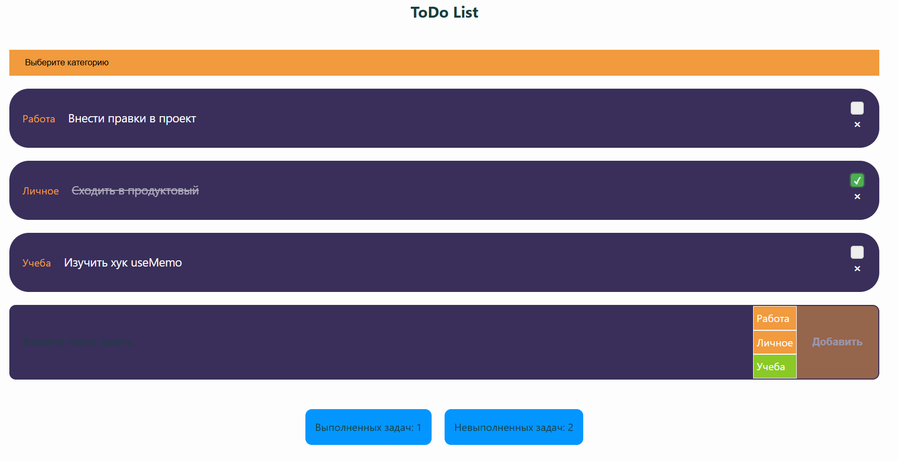

# 📝 ToDo List

Простое, но функциональное приложение для управления списком задач. Проект реализован на **React** с использованием **TypeScript**, **Styled-components** и хранением данных в **localStorage**.

## 📸 Превью



## 🚀 Функциональность

- ✅ Добавление новых задач с выбором категории
- 📂 Категории задач: Работа, Личное, Учёба
- 🔍 Фильтрация задач:
  - Все задачи
  - Выполненные
  - Невыполненные
- 🗑️ Удаление задач
- 🔄 Переключение статуса выполнения
- 📊 Статистика: количество выполненных и невыполненных задач
- 💾 Сохранение задач в `localStorage` (персистентность между сессиями)

## 🧱 Стек технологий

- ⚛️ **React** — UI-библиотека
- 🟦 **TypeScript** — статическая типизация
- 💅 **styled-components** — стилизация компонентов
- 📦 **Vite** — сборщик проекта
- 🧠 **useState**, **useMemo**, **useEffect** — управление состоянием и производительность
- 🌈 Темизация — поддержка тёмной/светлой темы через ThemeProvider (при необходимости)

## 📚 Чему научился
Практика с useMemo и оптимизация рендеров
Работа с локальным хранилищем
Типизация пропсов и состояния в TypeScript
Разделение логики и UI через компонентный подход

## 🧑‍🎓 Автор
Александр Гвоздев
Начинающий Frontend-разработчик (React, TypeScript)

## 🧑‍💻 Установка и запуск

```bash
git clone https://github.com/gvozdev-aleksandr/test-2.git
cd имя-папки
npm install
npm run dev
